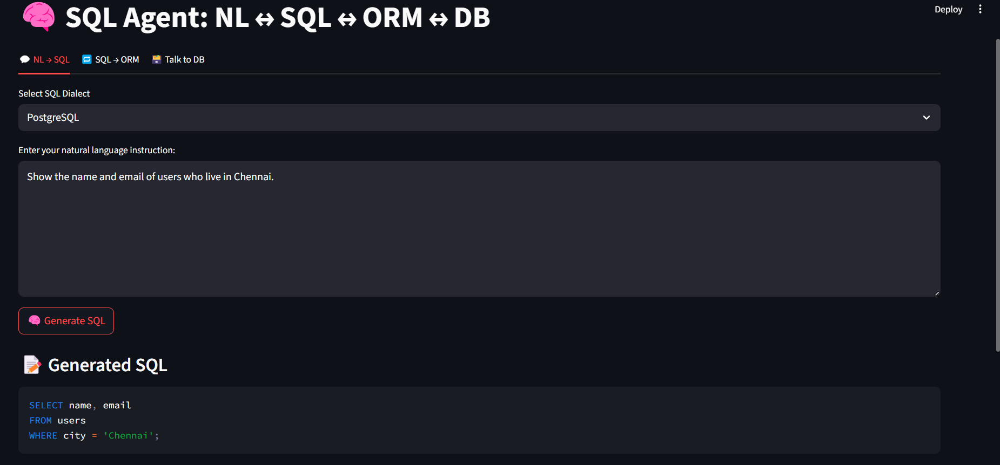
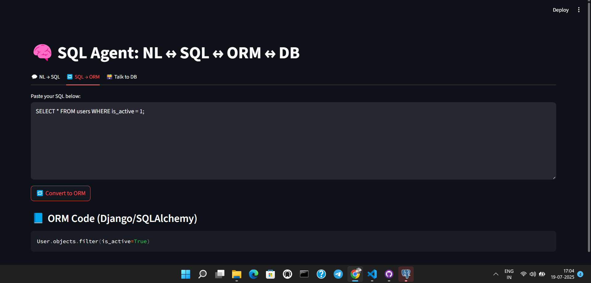
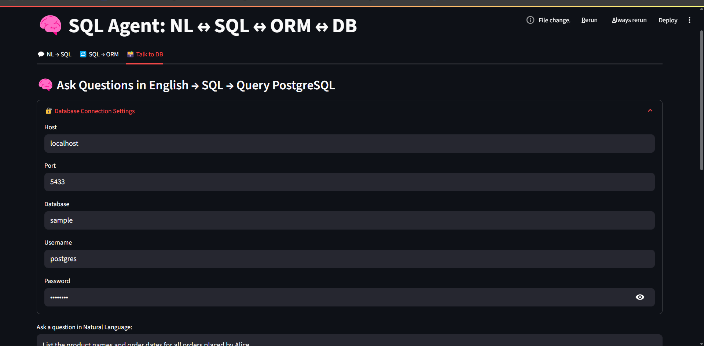
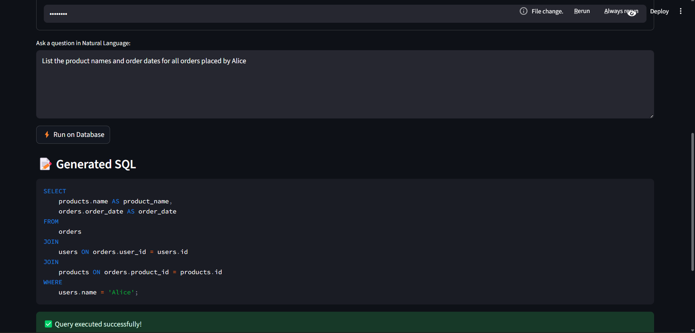
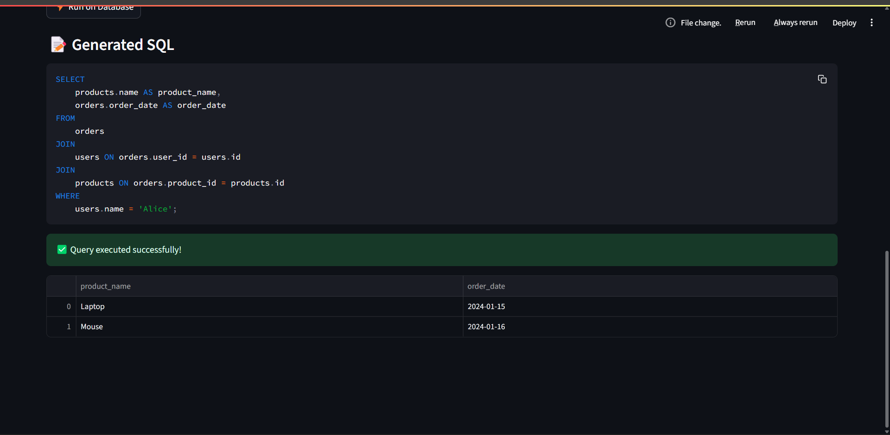

# 🧠 SQL Agent – NL ↔ SQL ↔ ORM Converter

SQL Agent is an AI-powered Streamlit web app that:
- Converts **Natural Language → SQL**
- Converts **SQL → ORM Code** (Django or SQLAlchemy)
- Supports **PostgreSQL**, **MySQL**, and **SQLite** dialects

Built with OpenRouter-compatible LLMs like DeepSeek, the app lets you write or understand database logic using everyday language or SQL.

---

## 🚀 Features

✅ Natural Language to SQL Query Generator  
✅ SQL to Django ORM / SQLAlchemy Code Converter  
✅ Dialect Selector (PostgreSQL, MySQL, SQLite)  
✅ Clean SQL Formatting with `sqlparse`  
✅ Prompt Injection with Safety Filters (no junk inputs like “hello”)

---

## 🖼️ Screenshots

### 🔹 Natural Language → SQL
> _"Show the name and email of users who live in Chennai."_



---

### 🔹 SQL → ORM
> ```sql
> SELECT * FROM users WHERE is_active = 1;
> ```



---

### 🔹 Talk to DB
> _"List the product names and order dates for all orders placed by Alice."_






---


## 🗂️ File Structure

sql-agent-nl2sql-orm/
├── app.py
├── utils/
│ ├── llm_handler.py
│ └── parser_utils.py
├── prompts/
│ ├── nl_to_sql.txt
│ └── sql_to_orm.txt
├── .env
├── requirements.txt
└── README.md

---

## 🧪 Sample Inputs

### 🧠 Natural Language → SQL

**Input:**
Get all users who joined after January 2023

sql
Copy
Edit
**Output:**
```sql
SELECT * FROM users WHERE join_date > '2023-01-01';
🔁 SQL → ORM
Input:

sql
Copy
Edit
SELECT * FROM users WHERE is_active = 1;
Output (Django ORM):

python

User.objects.filter(is_active=True)

LLM Model: DeepSeek-Qwen3-8B

UI: Streamlit

SQL Formatter: sqlparse

